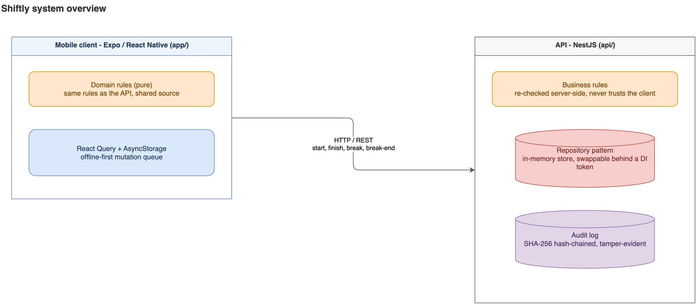

# Shiftly

A reference implementation of a shift clock-in/out flow for hourly workers: see your
upcoming shifts, clock in within the scheduled window, take breaks, and clock out -
enforced by a small set of server-side business rules (time windows, geofencing, break
limits) and a distinct error code per rule.

```
.
├── app/    # Expo / React Native client
├── api/    # NestJS backend - repository pattern, tamper-evident audit log, tests
└── docs/   # release process
```



## Running

```bash
# 1. Start the API
cd api && npm install && npm start
# listens on http://localhost:3000

# 2. Start the app
cd app && npm install && npx expo start
```

Stop everything: `./scripts/stop-dev.sh`.

See [api/README.md](api/README.md) for the API contract and business rules, and
[app/README.md](app/README.md) for the client's architecture, getting-started details,
and test/lint/typecheck commands.

## Business rules

| Rule | HTTP |
|---|---|
| Clock in only within 15 minutes before the scheduled start | 409 |
| Clock out only within 30 minutes after the scheduled end | 409 |
| Clock in/out only within 50 metres of the branch location | 409 |
| At most 2 breaks per shift, each at least 2 minutes | 409 |

Full error catalogue: [api/README.md#business-rules](api/README.md#business-rules).

## License

Apache 2.0 - see [LICENSE](./LICENSE).

## Disclaimer

Provided as-is, for demonstration purposes. Nothing here is legal, security, financial,
or professional advice. You use it entirely at your own risk and are solely responsible
for anything you do with it - cloning, building, running, deploying, or adapting -
including meeting any licensing, privacy, and regulatory obligations that apply to you.
