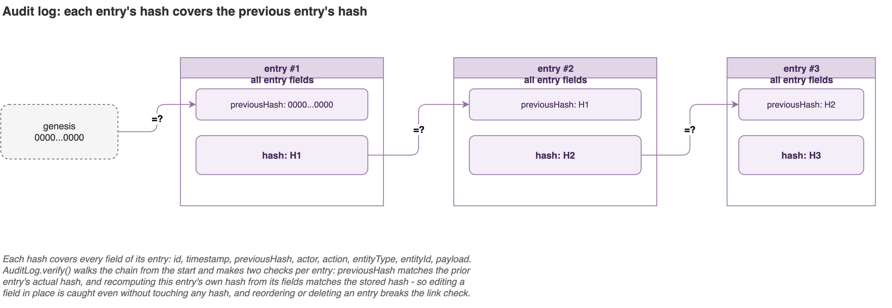
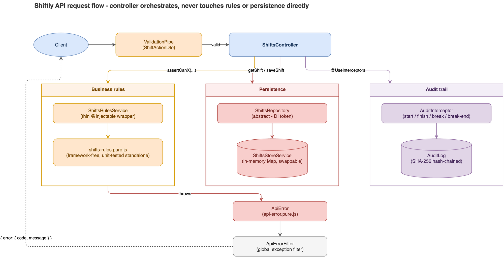

# Shiftly API

NestJS + Express backend for Shiftly, a clock-in/clock-out app for shift workers. All
state is held in memory and reset on every boot - generating a fresh set of demo shifts.
Single-instance only: the store is process-local, so running more than one replica
would show each a different shift list until a real shared datastore replaces
`ShiftsStoreService` behind the `ShiftsRepository` interface.

Requires Node 24 LTS (the current Active LTS; CI runs the same line).

## Running

```bash
npm install
npm start          # nest build && node dist/main.js
# or
npm run dev         # nest start --watch
```

The server logs the generated fixtures, including the **`id`** of each shift and the
demo **`userId`**. The first shift in the list is always scheduled to start exactly
**16 minutes from boot** on the current calendar day, so you can drive a real
start-shift flow end to end.

Default port: `3000` (override with `PORT=4000 npm start`).

Set `SEED_DEMO_DATA=false` to boot with an empty store instead of generating random
demo shifts - there's currently no other way to get data in (no create-shift endpoint),
so this stays on by default even when `NODE_ENV=production`, with a loud warning logged
in that case. Turn it off once a real persistence layer replaces the in-memory store.

See `.env.example` for every environment variable the server reads.

### Running in Docker

```bash
docker build -t shiftly-api .
docker run -p 3000:3000 shiftly-api
```

Multi-stage build, runs as a non-root user, no dev dependencies in the final image.

### Logs

Structured JSON on stdout via [`nestjs-pino`](https://github.com/iamolegga/nestjs-pino) -
every `@nestjs/common` `Logger` call and every HTTP request is a JSON line. Set
`LOG_LEVEL` to change verbosity (default `info`).

## Conventions

- All request and response bodies are JSON.
- Timestamps are ISO-8601 strings (`2026-06-25T14:00:00.000Z`).
- Geo locations are `{ "lat": number, "lng": number }`.
- The server identifies the user via `userId` (body or `?userId=` query). There is a
  single demo user and no authentication.
- Errors use a consistent envelope:
  ```json
  { "error": { "code": "SHIFT_WRONG_DAY", "message": "...", "details": {} } }
  ```

## Endpoints

### `GET /shifts/list`

Returns the upcoming shifts for the user.

```http
GET /shifts/list?userId=user-demo
```

```json
{
  "shifts": [
    {
      "id": "...",
      "userId": "user-demo",
      "brand":  { "id": "brand-kitsune-madrid", "name": "Kitsune de Madrid" },
      "branch": {
        "id": "branch-malasana",
        "name": "Malasaña",
        "location": { "lat": 40.4262, "lng": -3.7038 }
      },
      "startDate": "2026-06-25T14:16:00.000Z",
      "endDate":   "2026-06-25T22:16:00.000Z",
      "startedAt": null,
      "finishedAt": null,
      "startedAtLocation": null,
      "finishedAtLocation": null
    }
  ]
}
```

### `POST /shifts/:shiftId/start`

Clock in to a shift.

```json
{
  "userId": "user-demo",
  "datetime": "2026-06-25T14:10:00.000Z",
  "location": { "lat": 40.4262, "lng": -3.7038 }
}
```

`datetime` is optional - the server falls back to its own clock if omitted.

### `POST /shifts/:shiftId/finish`

Clock out of a shift. Same body shape as `/start`. Any open break is closed
automatically with the same `datetime`.

### `POST /shifts/:shiftId/break`

Start a break.

```json
{ "userId": "user-demo", "datetime": "2026-06-25T16:30:00.000Z" }
```

### `POST /shifts/:shiftId/break/end`

End the active break.

```json
{ "userId": "user-demo", "datetime": "2026-06-25T16:45:00.000Z" }
```

### `GET /shifts/:shiftId/break/list`

Returns every break taken on the shift (oldest first).

```json
{
  "breaks": [
    { "id": "...", "shiftId": "...", "startedAt": "...", "endedAt": "..." }
  ]
}
```

## Business rules

| Rule | Error code | HTTP |
|---|---|---|
| Shift not found | `SHIFT_NOT_FOUND` | 404 |
| Cannot start a shift on a different day | `SHIFT_WRONG_DAY` | 409 |
| Cannot start a shift earlier than 15 minutes before its scheduled start | `SHIFT_START_TOO_EARLY` | 409 |
| Cannot start a shift that is already started | `SHIFT_ALREADY_STARTED` | 409 |
| Cannot start or finish a shift that has finished | `SHIFT_ALREADY_FINISHED` | 409 |
| Cannot finish a shift that has not started | `SHIFT_NOT_STARTED` | 409 |
| Cannot finish a shift more than 30 minutes after its scheduled end | `SHIFT_FINISH_TOO_LATE` | 409 |
| Cannot clock in or out more than 50 metres from the branch location | `SHIFT_OUT_OF_RANGE` | 409 |
| Cannot break less than 2 minutes after starting the shift | `BREAK_TOO_SOON_AFTER_START` | 409 |
| Cannot take more than 2 breaks per shift | `BREAK_LIMIT_REACHED` | 409 |
| Cannot start a break while already on one | `BREAK_ALREADY_ACTIVE` | 409 |
| Cannot end a break less than 2 minutes after starting it | `BREAK_END_TOO_SOON` | 409 |
| Cannot end a break when none is active | `BREAK_NOT_ACTIVE` | 409 |
| Malformed body (bad coordinates, invalid date, ...) | `VALIDATION_ERROR` | 400 |

## Audit trail

Every successful `start` / `finish` / `break` / `break/end` request is recorded in an
in-memory, SHA-256 hash-chained log (`src/audit/`). Each entry's hash covers the previous
entry's hash, so editing, reordering, or deleting a past entry is detectable via
`AuditLog.verify()`.

Scope: this covers tamper-evidence only, not compliance. Retention periods, required
fields, and access rules are jurisdiction-specific (EU/US/LATAM/APAC labor-law
recordkeeping requirements differ) and require a real compliance review, not defaults set
here.



## Architecture

Every mutating request flows through the same shape: controller -> rules check ->
repository write -> audit entry. The controller never touches business rules or
persistence directly - it only orchestrates. Sources are editable in
[docs/diagrams](docs/diagrams).



- **Pure/impure split.** `shifts-rules.pure.js` and `api-error.pure.js` have no NestJS
  imports, so they're unit-tested with no DI container or HTTP layer. `ShiftsRulesService`
  just makes that logic injectable.
- **`ShiftsRepository` is a DI token, not `ShiftsStoreService` directly.** Consumers
  depend on the token; swapping the backing store is a one-line rebind in
  `shifts.module.ts`. `AuditLog` uses the same pattern.
- **Audit is an interceptor, not inline calls.** `AuditInterceptor` reads `userId` and the
  first route param generically, with no dependency on `shifts/` types.
- **Request shape validation is a global `ValidationPipe`, not manual parsing.**
  `shifts-action.dto.ts` declares the shape (`class-validator` decorators); a custom
  `exceptionFactory` (`common/validation.pipe.ts`) maps a failure into the same
  `VALIDATION_ERROR` envelope every other error uses, so a malformed request looks
  identical to any other rejected one from the client's perspective.

## Layout

```
src/
├── main.ts                          # bootstrap
├── app.module.ts                    # root module
├── health.controller.ts             # GET /health
├── common/
│   ├── api-error.pure.js            # ApiError + error catalogue (untransformed JS -
│   │                                   the contract test requires this file directly)
│   ├── api-error.filter.ts          # global exception filter -> error envelope
│   └── validation.pipe.ts           # global ValidationPipe, maps to the error envelope
├── audit/                           # tamper-evident audit trail (domain-agnostic)
│   ├── audit-event.types.ts          # AuditEvent / NewAuditEvent / filter types
│   ├── audit-log.ts                  # AuditLog abstract class (DI token)
│   ├── in-memory-audit-log.service.ts # SHA-256 hash-chained implementation
│   ├── audit.interceptor.ts          # records one entry per mutating request
│   └── audit.module.ts
├── testing/
│   └── shift-fixtures.ts             # shared makeShift/BRANCH/HERE test builders
└── shifts/
    ├── shift.types.ts                # Shift/Break/GeoPoint types
    ├── shifts-rules.pure.js          # business rules (untransformed JS, same reason)
    ├── shifts-rules.service.ts       # thin @Injectable() wrapper over the pure rules
    ├── shifts.repository.ts          # ShiftsRepository abstract class (DI token)
    ├── shifts-store.service.ts       # in-memory ShiftsRepository implementation
    ├── shifts-fixtures.provider.ts   # boot-time shift generation
    ├── shifts-action.dto.ts          # request body shape (class-validator)
    ├── shifts-request.utils.ts       # userId resolution + validated-field conversion
    ├── shifts.controller.ts          # all six endpoints
    └── shifts.module.ts
```
