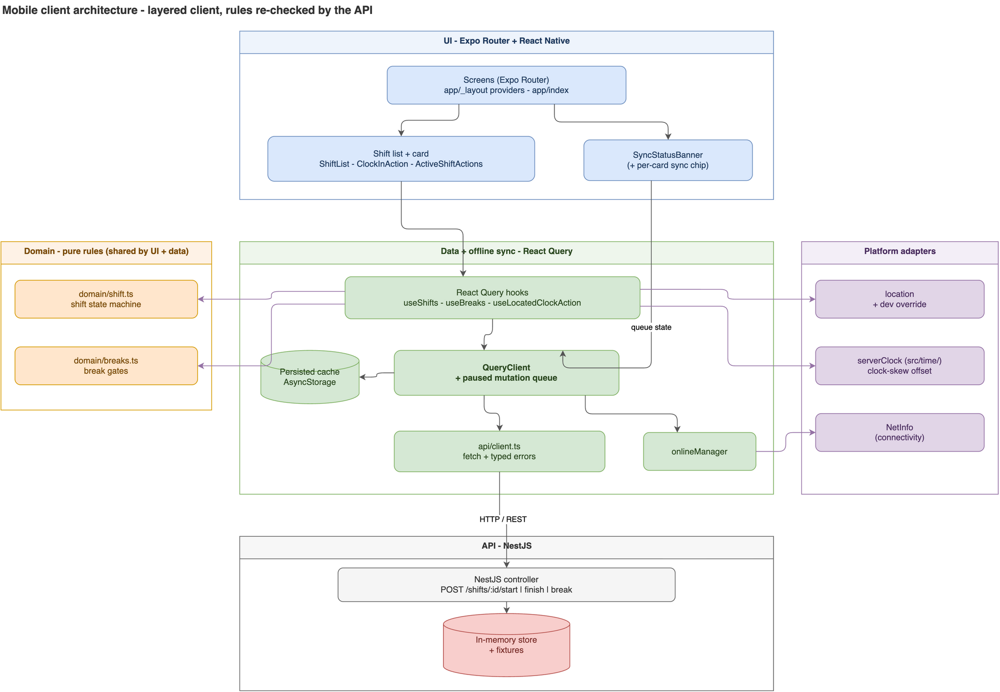
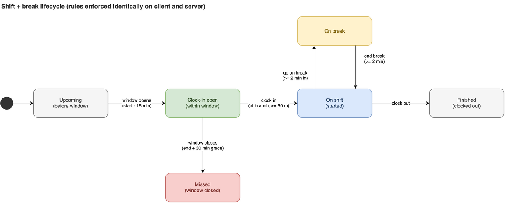
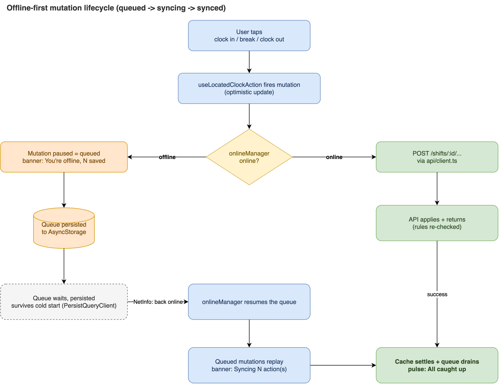

# Shiftly - mobile client

[](https://github.com/pzverkov/shiftly-rn/actions/workflows/ci.yml)

Clock in to a shift, from your phone. Built with Expo (SDK 57) and React Native.

Shift workers see their upcoming shifts, clock in on the imminent one inside the
allowed time window, go on break, end the break, and clock out - each gated by the same
rules the API enforces - with designed loading, empty, and error states and a layered
offline UX that shows what is queued, syncing, and synced. Clock-out and breaks reuse
the clock-in foundations rather than duplicate them - see
[Scope](#scope-what-is-here-and-what-is-not).

For the reasoning behind the non-obvious parts, see
[ARCHITECTURE.md](docs/ARCHITECTURE.md). This README is the tour; that file is the why.

## Getting started

Requires Node 24 LTS (the current Active LTS, and the floor `react-native@0.86`
actually declares support for via its `^24.3.0` range - see `package.json`'s
`engines` field). CI runs the same line.

```bash
# 1. Start the API (from the repo root)
cd api && npm install && npm start

# 2. Start the app
cd app && npm install && npx expo start
```

Then press `i` for the iOS simulator, `a` for Android, or scan the QR code with Expo
Go. No custom native code is used, so **Expo Go works** - there is no dev build to
make.

### Pointing at the API

The app defaults to `http://localhost:3000`. Override it with `EXPO_PUBLIC_API_URL`:

| Target | Value |
| --- | --- |
| iOS simulator | `http://localhost:3000` (the default) |
| Android emulator | `http://10.0.2.2:3000` |
| Physical device | `http://<your-machine-LAN-IP>:3000` |

```bash
EXPO_PUBLIC_API_URL=http://10.0.2.2:3000 npx expo start
```

`localhost` on a phone resolves to the phone, not your machine.

### Seeing the clock-in flow

The API always schedules one shift **16 minutes from boot**, and the window opens 15
minutes before a shift starts. So roughly **one minute after you start the API** the
countdown reaches zero and the button unlocks on its own.

**The branches are in Spain and the API rejects a clock-in from more than 50m away**,
so a simulator anywhere else can never clock in without help. Rather than weaken the
geofence handling, a **dev-only toggle at the top of the list** ("Simulate being at the
branch") substitutes the branch coordinates. It is on by default in development and
cannot exist in a release build (`__DEV__`).

To exercise the real path, turn it off and set the simulator's location
(Features > Location > Custom, `40.4262, -3.7038` for Malasaña).

### Checks

```bash
npm test        # the Jest suite
npm run typecheck
npm run bench   # domain micro-benchmark
npm run docs    # generate the API reference (TypeDoc) into docs/api
```

`npm run docs` renders the logic layers' JSDoc into a browsable reference under
`docs/api` (git-ignored). The release workflow builds the same reference and uploads it
as a build artifact, so every tagged build ships a reference alongside it.

`npm audit` reports a residual set of transitive advisories (`uuid`, `image-size`, both
pulled in via `@expo/config-plugins`) that only resolve through `npm audit fix --force`,
which downgrades `expo` from SDK 57 to SDK 53 - a real regression, not taken. Dependabot
(`.github/dependabot.yml`) tracks upstream fixes weekly so this doesn't need manual
re-checking.

## Architecture at a glance

The client is layered: UI on top, a React Query data layer that owns the offline queue
and persistence, a pure domain layer holding the rules, and thin platform adapters. The
API re-checks the same rules. Sources are editable in [docs/diagrams](docs/diagrams).



The shift rules are a small state machine, mirrored on the client and enforced on the
API, so the button matches what the API will allow - a differential test keeps the two
in step (see [ARCHITECTURE.md](docs/ARCHITECTURE.md)):



Every clock action is a mutation that either fires now or is queued, persisted, and
replayed on reconnect - the queued, syncing, and synced states the banner surfaces:



## Scope: what is here, and what is not

The shift list, clock-in, breaks, clock-out, designed loading/empty/error states, and a
layered offline UX. The cold-start load shows a skeleton of shift-shaped placeholder
cards rather than a lone spinner; the offline surface layers a queued-action count, a
per-card syncing/synced chip, and a reconnect banner over the pause-and-replay
plumbing.

The deliberate trade is depth over breadth. The API clock, the error taxonomy, and the
offline mutation path were expensive to build and cheap to reuse, so clock-out and
breaks came in as the same machinery with a different endpoint and a rule from the same
table.

## What's next

1. **A shift detail screen.** The list is the right home surface, but breaks and a
   running timer want their own room. The router is already in place for it.
2. **Close the offline-replay timestamp gap.** The live path is server-authoritative
   now; a replayed offline clock-in or break is the remaining spoofable case, which
   needs a server-signed or server-authoritative scheme to fully harden.
3. **Shift history and hours totals.** Finished shifts are filtered out of the list
   today, so a worker cannot review what they logged or how many hours a period came
   to. The API already returns finished shifts with `startedAt`/`finishedAt` and their
   breaks, so this is a route plus aggregation, not new plumbing.
4. **Fresh device screenshots.** No screenshots are included yet; a capture pass on a
   device/simulator is a natural follow-up.

## Disclaimer

Provided as-is, for demonstration purposes. Nothing here is legal, security, financial,
or professional advice. You use it entirely at your own risk and are solely
responsible for anything you do with it - cloning, building, running, deploying, or
adapting - including meeting any licensing, privacy, and regulatory obligations that
apply to you. See [LICENSE](../LICENSE).
